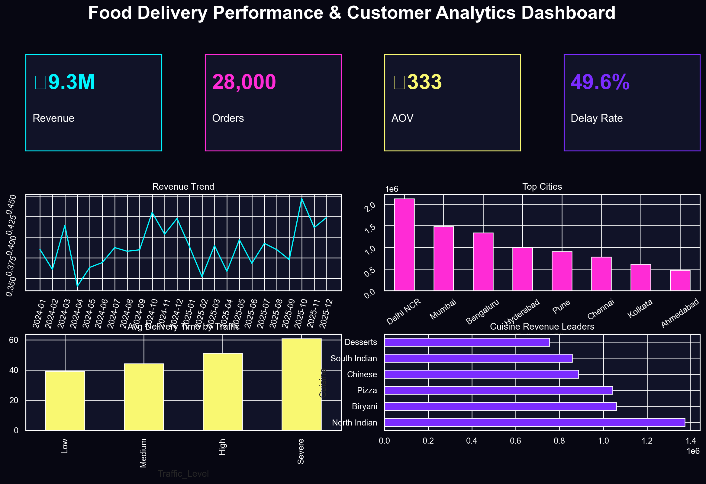

# Food Delivery Performance & Customer Analytics Dashboard


## 🚀 Project Overview

An end-to-end analytics engineering and BI portfolio project for a food delivery platform similar to Zomato, Swiggy, Uber Eats, or DoorDash. The project simulates a real business environment with messy raw data, data cleaning, KPI engineering, SQL analysis, executive reporting, and an interactive Streamlit dashboard.

## 🎯 Business Problem

Food delivery companies need to optimize delivery speed, reduce cancellations, increase customer retention, and improve restaurant/partner performance. This project answers:

- Which cities, restaurants, and cuisines drive revenue?
- What causes delivery delays and low ratings?
- Which customers are high-value or at risk?
- How do traffic, weather, distance, and peak hours impact operations?
- What actions can improve profitability and customer experience?

## 🏗️ Architecture

```text
Synthetic Raw Data → Cleaning & Feature Engineering → Processed KPIs → SQL Analysis → Streamlit Dashboard → Executive Reports
```

## 🧰 Tech Stack

Python, Pandas, NumPy, SQL, Streamlit, Plotly, Matplotlib, Seaborn, Excel, Git/GitHub, Power BI dashboard mockup.

## 📦 Dataset Description

Synthetic but realistic datasets generated for portfolio use:

| Table | Rows | Purpose |
|---|---:|---|
| Orders | 28,260 raw / 28,000 cleaned | Transaction-level order, delivery, revenue, and rating data |
| Customers | 5,560 raw / 5,500 cleaned | Demographics, signup, loyalty, and CLV |
| Restaurants | 850 | Cuisine, ratings, revenue, and preparation metrics |
| Delivery Partners | 900 | Vehicle, rating, completed orders, delivery speed |

Raw data intentionally includes missing values, duplicates, outliers, incorrect date formats, cancellations, delays, and business noise.

## 📊 KPIs

- Total Revenue
- Total Profit
- Average Order Value
- Order Volume
- Cancellation Rate
- Delayed Order Rate
- Average Delivery Duration
- Customer Rating
- Customer Lifetime Value
- Delivery Efficiency Score
- Profit Margin

## 🖥️ Dashboard Pages

1. Executive Overview
2. Customer Analytics
3. Delivery Performance
4. Restaurant Insights
5. Revenue & Profitability
6. Operational Insights

## 📸 Screenshots



## 🔍 Key Business Insights

### 1. High traffic increases delivery time
- **Observation:** Severe traffic orders take significantly longer than low traffic orders.
- **Impact:** Late deliveries reduce customer ratings and increase cancellation/refund risk.
- **Recommendation:** Use traffic-aware ETA buffers and dynamic partner allocation.

### 2. Weekend orders have higher AOV
- **Observation:** Weekend customers spend more per order than weekday customers.
- **Impact:** Weekend campaigns can improve revenue without requiring proportional order growth.
- **Recommendation:** Launch premium combos, family bundles, and loyalty offers on weekends.

### 3. High-value customers drive revenue concentration
- **Observation:** A smaller cohort of repeat customers contributes a large revenue share.
- **Impact:** Retention of Gold/Platinum users is critical for stable revenue.
- **Recommendation:** Build VIP offers, early-access discounts, and churn-risk alerts.

### 4. Weather disruption affects ratings
- **Observation:** Rain, storm, and fog conditions increase delays and reduce experience quality.
- **Impact:** Customer dissatisfaction rises when ETAs are inaccurate.
- **Recommendation:** Add bad-weather surge incentives and proactive customer notifications.

## 📁 Folder Structure

```text
food-delivery-performance-analytics-dashboard/
├── data/
│   ├── raw/
│   ├── cleaned/
│   └── processed/
├── notebooks/
├── sql/
├── dashboard/
│   ├── powerbi_dashboard.pbix
│   ├── dashboard_mockup.png
│   └── screenshots/
├── streamlit_app/
│   └── app.py
├── reports/
├── visuals/
├── requirements.txt
├── README.md
├── .gitignore
└── LICENSE
```

## ⚙️ Installation

```bash
git clone https://github.com/shivammhjn1302/food-delivery-performance-analytics-dashboard.git
cd food-delivery-performance-analytics-dashboard
python3 -m venv .venv
source .venv/bin/activate
pip install -r requirements.txt
```

## ▶️ Run Streamlit App Locally

```bash
streamlit run streamlit_app/app.py
```

## ☁️ Deploy Streamlit

1. Push this repo to GitHub.
2. Go to [share.streamlit.io](https://share.streamlit.io/).
3. Select the repository.
4. Set main file path:

```text
streamlit_app/app.py
```

5. Deploy.

## 🧾 SQL Examples

```sql
WITH cuisine_rev AS (
  SELECT r.cuisine, r.restaurant_name, SUM(o.final_price) revenue
  FROM orders o
  JOIN restaurants r ON o.restaurant_id = r.restaurant_id
  GROUP BY r.cuisine, r.restaurant_name
)
SELECT *, RANK() OVER(PARTITION BY cuisine ORDER BY revenue DESC) AS cuisine_rank
FROM cuisine_rev;
```

Full SQL scripts are available in [`sql/business_queries.sql`](sql/business_queries.sql) and [`sql/kpi_queries.sql`](sql/kpi_queries.sql).

## 📈 Visuals

- Revenue trends
- City-wise performance
- Traffic vs delivery time
- Cuisine popularity
- Rating distribution
- Correlation heatmap

## 🔮 Future Improvements

- Real-time order streaming simulation
- Delivery ETA prediction model
- Churn prediction model
- Restaurant recommendation engine
- Geospatial routing and heatmaps
- Power BI live connection to SQL database

## 💼 Resume Value

This project demonstrates skills required for Data Analyst, BI Developer, Product Analyst, and Analytics Engineer roles:

- Data cleaning and feature engineering
- KPI design and business storytelling
- SQL joins, CTEs, window functions, ranking, retention analysis
- Executive dashboarding
- Streamlit app development
- Analytical recommendations with business impact

---

**Author:** Shivam Mahajan  
**Project:** Food Delivery Performance & Customer Analytics Dashboard
